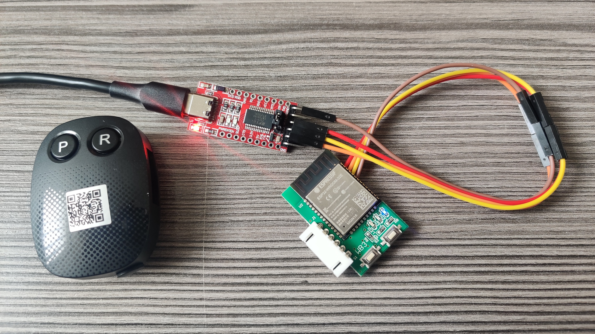

# CB19 ESPHome Gate Controller

[](https://esphome.io/components/external_components/)
[](https://github.com/szokezoltan95/CB19-esphome/releases)


Custom ESPHome component for CB19 gate controllers over UART.

This project replaces the original WiFi module with a fully local ESPHome integration and provides full control, diagnostics, telemetry, and configuration of the gate directly from Home Assistant.

> [!IMPORTANT]
> A custom Lovelace card is available for this component: **CB19 ESPHome Card**  
> https://github.com/szokezoltan95/CB19-esphome-card
>
> The card is designed for the new non-cover architecture and supports separate gate wing animation, richer state display, and a tailored control UI.

---

## Features

- Open, close, stop, pedestrian open
- Gate-state handling based primarily on `$V1PKF` state messages
- RS frames used for telemetry and diagnostics
- Real-time gate telemetry:
  - motor 1 raw position
  - motor 2 raw position
  - motor 1 speed
  - motor 1 load
  - motor 2 speed
  - motor 2 load
- Individually calibrated motor positions
- Final gate position calculated from calibrated motor positions
- Pedestrian mode handling with gate position based on motor 1 only
- Photocell and obstruction detection
- Manual stop detection
- Full parameter read/write support (`RP,1` / `WP,1`)
- Pending vs current parameter handling
- Remote management:
  - add remote
  - remove remote
- Auto learn with automatic polling
- Factory reset (hidden entity for safety)
- Full Home Assistant integration

---

## Architecture Notes

The current `main` branch contains the new architecture.

### What changed from the old design

- The old `cover` entity model has been removed
- Gate state now comes from the protocol state machine instead of percent-based endstop guessing
- `$V1PKF` messages are treated as the primary source of gate state
- RS frames are used for telemetry, diagnostics, and runtime measurements
- Motor positions are calibrated individually
- Final gate position is derived from the calibrated motor positions
- Pedestrian opening is handled as a dedicated mode

### State model

Main text state:

- `Opening`
- `Closing`
- `Opened`
- `Closed`
- `PedOpening`
- `PedOpened`
- `Stopped`
- `AutoClosing`

Important binary states:

- `moving`
- `fully_opened`
- `fully_closed`
- `ped_opened`
- `manual_stop`
- `photocell_active`
- `obstruction_active`

---

## Hardware

Required:

- ESP32
- UART connection to CB19 controller
- Level shifting (Gate TX → ESP RX)

Example divider:

```text
Gate TX ---[10k]---+--- ESP RX
                   |
                 [18k]
                   |
                  GND
```

Notes:

- Do **NOT** connect Gate TX directly to ESP RX
- ESP TX → Gate RX usually works directly
- Keep wiring short and clean
- Stable grounding matters a lot for reliable UART communication

---

### Factory TMT WiFi module

Optionally, it is possible to install it on the TMT factory WiFi module.



1. A 3,3V FTDI programming board is needed
2. Solder the wires to the exposed UART pads on the back side of the PCB
3. While powering up, hold down the **P** button to enter bootloader mode
4. Optional - Use `esptool` to make a backup of the factory firmware:
	```esptool --chip esp32 --port <portnr> read-flash 0 0x1000000 backup.bin```
5. Upload the esphome firmware as usual

Notes:
- The factory WiFi module uses the same UART pins as in the example yaml, so nothing needs to be changed
- Optionally, to ensure working OTA updates in the future, set the size of the flash memory to 16 MB:

```yaml
esp32:
  board: esp32dev
  flash_size: 16MB
  framework:
    type: arduino
```

---

## Installation

### Add external component

```yaml
external_components:
  - source: github://szokezoltan95/CB19-esphome@main
    components: [cb19_gate]
```

### UART setup

```yaml
uart:
  id: gate_uart
  tx_pin: GPIO17
  rx_pin: GPIO16
  baud_rate: 9600
```

### Basic config

```yaml
cb19_gate:
  id: gate_controller
  uart_id: gate_uart

  pedestrian_button:
    name: Pedestrian Open

  open_button:
    name: Open

  close_button:
    name: Close

  stop_button:
    name: Stop

  gate_state:
    name: Gate State

  gate_position:
    name: Gate Position
```

Full example:

`examples/cb19_example.yaml`

---

## Home Assistant Entity Model

### Main control

- Open button
- Close button
- Stop button
- Pedestrian Open button
- Gate State
- Gate Position
- Moving
- Fully Opened
- Fully Closed
- Pedestrian Opened
- Manual Stop
- Photocell
- Obstruction

### Diagnostics

- Last ACK
- Last RS
- Learn Status
- Current parameter block
- Pending parameter block
- Config warning
- Motor 1 raw / position / speed / load
- Motor 2 raw / position / speed / load

### Configuration

1. Read Parameters
2. Write Parameters
3. Revert Pending Parameters
4. Add Remote
5. Remove Remote
6. Auto Learn
7. Factory Reset

All F-code parameters are exposed as select entities.

---

## Parameter Workflow

1. Change parameters, they are stored as pending
2. Press **Write Parameters**
3. `WP,1` is sent
4. `RP,1` readback is requested
5. The system syncs back to Home Assistant

---

## Learn Workflow

- Auto Learn starts the process
- The component polls learn status roughly every second
- Polling stops on success, failure, or timeout

---

## Position Calibration

The controller is not naturally normalized to 0–100.

Observed values may differ depending on installation and mechanics.

Adjust in Home Assistant:

- `Opening Start Percent`
- `Closing Start Percent`

These values are now applied to the motor positions individually, and the final gate position is then calculated from those calibrated motor positions.

---

## Polling

- Fast while moving
- Slower shortly after a stop
- Very slow when idle
- Periodic parameter resync via `RP,1`

---

## Protocol

See `docs/protocol.md`

---

## Lovelace Card

For the best Home Assistant frontend experience, use the companion custom card:

**CB19 ESPHome Card**  
https://github.com/szokezoltan95/CB19-esphome-card

Recommended when you want:

- dedicated gate UI instead of generic entities
- separate left/right gate wing animation
- pedestrian mode visualization
- a cleaner control panel for everyday use

---

## License

See `LICENSE`.
